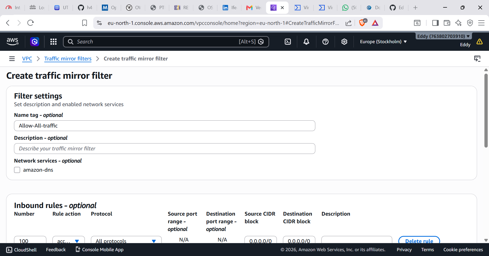
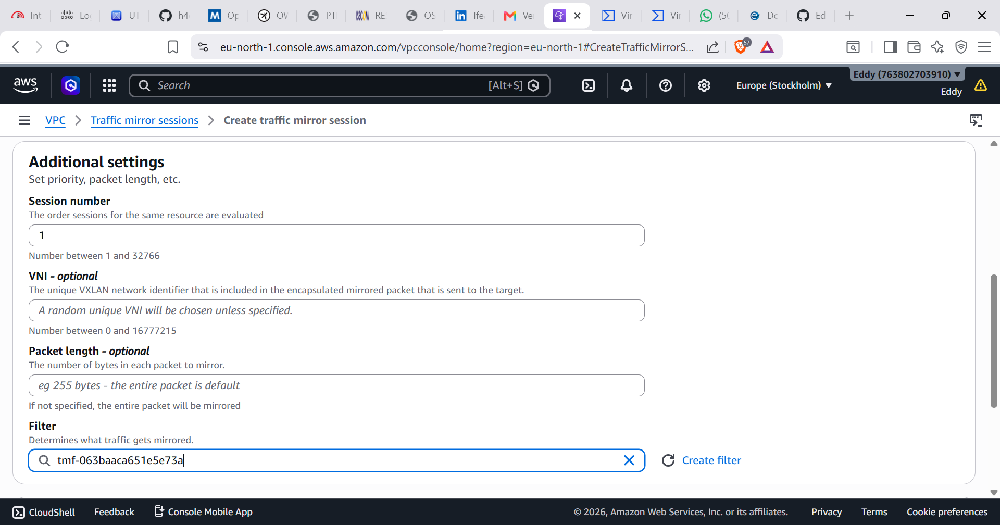

# SOC Lab Network Design

## Overview

> This document explains the network architecture used for the SOC detection lab.

The lab simulates a real-world security monitoring environment using AWS infrastructure, endpoint monitoring, network detection, and attack simulation.

<a href="https://aws.amazon.com/security/penetration-testing/">

</a>

---

# Architecture Components

## 1. Wazuh Manager

Platform:
- AWS EC2 Linux Server

Role:
- Central SIEM/XDR platform
- Collects security logs
- Processes alerts
- Performs threat detection

Receives logs from:

- Windows Server Wazuh Agent
- Ubuntu Suricata Sensor

---

## 2. Windows Server Endpoint

Platform:
- AWS EC2 Windows Server

Security Tools:

- Wazuh Agent
- Microsoft Sysmon

Purpose:

Collect endpoint telemetry:

- Process creation
- Authentication events
- PowerShell activity
- Network connections
- File changes


Monitoring flow:
```yaml
Windows Server
|
|
Wazuh Agent
|
|
Wazuh Manager
```
---

## 3. Ubuntu Suricata Sensor

Platform:
- AWS EC2 Ubuntu

Security Tool:

- Suricata IDS


Purpose:

- Network traffic inspection
- Intrusion detection
- Protocol monitoring


Configuration:

Interface monitored:
```
ens5
```
Log location:

```bash
/var/log/suricata/eve.json
```

Traffic flow:
```yaml
Network Traffic
|
|
Suricata
|
|
eve.json
|
|
Wazuh
```

---

## 4. Kali Linux Attacker

Platform:

- Local Virtual Machine

Purpose:

Security testing and attack simulation.

Tools:

- Nmap
- Hydra
- Enumeration tools


Examples:

Network scanning:

```bash
 nmap -sS <target-ip>
```
Brute force testing:
```bash
 hydra -l username -P passwords.txt ssh://traget-ip
```

Kali Linux
     |
     |
Attack Simulation
     |
     |
Windows / Ubuntu
     |
     |
Wazuh Agent + Suricata
     |
     |
Wazuh Manager
     |
     |
Dashboard Investigation


## AWS Traffic Mirroring Implementation

## Overview

AWS Traffic Mirroring was configured to allow the Suricata sensor to inspect traffic from other EC2 instances.

The goal was to mirror network traffic from the monitored instances and forward copies of packets to the Suricata monitoring instance.

Traffic Mirroring architecture:
```yaml
Kali Linux (Attacker)
        |
        | Attack traffic
        v
Windows Server EC2
        |
        | VPC Traffic Mirror
        v
Suricata IDS EC2
        |
        | eve.json / alerts
        v
Wazuh Manager / SOC Dashboard
```

---

## Traffic Mirroring Components

### Source

The source interface was configured using the Network Interface (ENI) of the monitored EC2 instance.

Purpose:

- Capture mirrored packets
- Forward traffic copies to the sensor
- A traffic filter that allows all lab traffic, both in & out.

Screenshot:




### Target

A Traffic Mirror Target was created pointing to the Suricata monitoring instance.

Purpose:

- Receive mirrored packets
- Deliver traffic to Suricata for inspection

Screenshot:


### Mirror Session

A Traffic Mirror Session was created to connect the source and target.

Configuration included:

- Source ENI
- Target ENI
- Session number
- Filter rules

Screenshot:




## Verification

Traffic capture was tested on the Suricata sensor using:

```bash
 sudo tcpdump -i ens5
```

Suricata interface:

```bash
interface: ens5
```

Suricata log location:

```bash
/var/log/suricata/eve.json
```

Current Implementation Status

Completed

- Wazuh Manager deployed
- Windows Server connected with Wazuh Agent
- Sysmon installed on Windows
- Suricata installed on Ubuntu
- Suricata logging enabled
- VirusTotal integration configured

Pending

Traffic Mirroring resources were created successfully.

⚠️However, Suricata was still mainly observing traffic directly reaching its own EC2 interface rather than the expected mirrored traffic.

## Update network architecture diagram with VPC traffic mirroring status

### Network Traffic Mirroring Status

The network architecture has been updated to include AWS VPC Traffic Mirroring.

Current implementation:
- ✅ Traffic Mirror Session created
- ✅ Source ENI configured (Windows Server EC2)
- ✅ Target ENI configured (Suricata IDS EC2)
- ✅ Mirrored traffic is reaching the Suricata instance
- ⚠️ Detection of all attack traffic is still under investigation

Current limitation:
Suricata is successfully receiving mirrored AWS network traffic, but some simulated attack traffic from the external Kali Linux environment is not yet being detected as expected.


The next troubleshooting steps include:
- Verifying Suricata interface capture configuration
- Validating VPC routing and Security Group rules
- Testing Suricata rules against mirrored packets
- Confirming that mirrored traffic contains the expected payload


## Project Status Update

Current state: ✅ Working

> The Suricata IDS deployment on AWS is now successfully receiving mirrored traffic from the Windows EC2 target through AWS    VPC Traffic Mirroring.

Previously investigated issues:
- Suricata received AWS network traffic but did not detect simulated attacks.
- Traffic mirror session was active but mirrored packets were not initially visible.
- Suricata rules were downloaded but showed `Enabled: 0 rules`.
- `fast.log` was empty while `eve.json` was receiving events.

Resolved:
- ✅ AWS Traffic Mirror source ENI verified
- ✅ AWS Traffic Mirror target ENI verified
- ✅ UDP 4789 GRE encapsulated mirror traffic verified
- ✅ Suricata interface configured correctly
- ✅ Suricata rules loaded successfully
- ✅ Custom rules enabled
- ✅ Alerts generated in eve.json
- ✅ fast.log detection working
- ✅ RDP brute-force activity detected
- ✅ Wazuh receives Suricata alerts

---

# Final Architecture

```yaml
 Kali Linux
 (Attack Simulation)
   |
   | RDP / SSH / Scan Traffic
   |
   v

 Windows Server EC2
 (Target Machine)
   |
   |
   | AWS VPC Traffic Mirroring
   | GRE over UDP 4789
   |
   v

 Suricata IDS EC2
 (Sensor)
    |
    |
    +---- eve.json
    |
    +---- fast.log
    |
    v
Wazuh Manager
(SOC Dashboard)
```

---

## Traffic-Mirroring Image:


