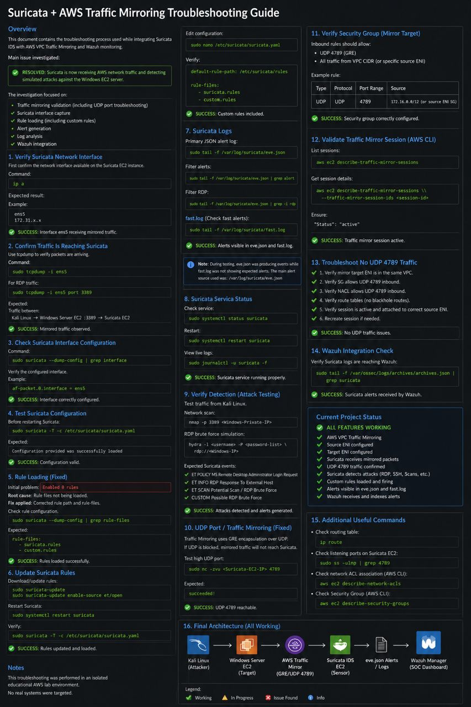

# 🪛🛠️Suricata + AWS Traffic Mirroring Troubleshooting Guide

## Project Status Update

Current state: ✅ Working

> The Suricata IDS deployment on AWS is now successfully receiving mirrored traffic from the Windows EC2 target through AWS    VPC Traffic Mirroring.

Previously investigated issues:
- Suricata received AWS network traffic but did not detect simulated attacks.
- Traffic mirror session was active but mirrored packets were not initially visible.
- Suricata rules were downloaded but showed `Enabled: 0 rules`.
- `fast.log` was empty while `eve.json` was receiving events.

Resolved:
- ✅ AWS Traffic Mirror source ENI verified
- ✅ AWS Traffic Mirror target ENI verified
- ✅ UDP 4789 GRE encapsulated mirror traffic verified
- ✅ Suricata interface configured correctly
- ✅ Suricata rules loaded successfully
- ✅ Custom rules enabled
- ✅ Alerts generated in eve.json
- ✅ fast.log detection working
- ✅ RDP brute-force activity detected
- ✅ Wazuh receives Suricata alerts

---

# Final Architecture

```
 Kali Linux
 (Attack Simulation)
   |
   | RDP / SSH / Scan Traffic
   |
   v

 Windows Server EC2
 (Target Machine)
   |
   |
   | AWS VPC Traffic Mirroring
   | GRE over UDP 4789
   |
   v

 Suricata IDS EC2
 (Sensor)
    |
    |
    +---- eve.json
    |
    +---- fast.log
    |
    v
Wazuh Manager
(SOC Dashboard)
```

---

# Suricata Rule Loading Issue (Resolved)

## Problem

Suricata showed:

Enabled: 0 rules

and: 

SC_ERR_NO_RULES(42) No rule files match

----


## Cause

Rules existed but Suricata was searching the wrong directory.

Configuration:

```
default-rule-path: /var/lib/suricata/rules
```

but custom rules existed in:

```
etc/suricata/rules/
```
----

## Fix

Copy rules:

```bash
sudo cp /etc/suricata/rules/custom.rules \
/var/lib/suricata/rules/
```

Verify:

```
ls /var/lib/suricata/rules
```

Expected:

```
suricata.rules
custom.rules
```

Test:

```
sudo suricata -T -c /etc/suricata/suricata.yaml
```

Expected:

```
Loaded rules
Enabled rules
```

Restart:

```
sudo systemctl restart suricata
```

---

### Custom Detection Rules

Location

```
sudo nano /var/lib/suricata/rules/custom.rules
```

Example RDP brute force rule:

```
alert tcp any any -> $HOME_NET 3389 \
(msg:"Possible RDP Brute Force Attempt"; \
flow:to_server; \
flags:S; \
threshold:type both, track by_src, count 5, seconds 60; \
sid:1000001; rev:1;)
```

Validate:

```
sudo suricata -T -c /etc/suricata/suricata.yaml
```



